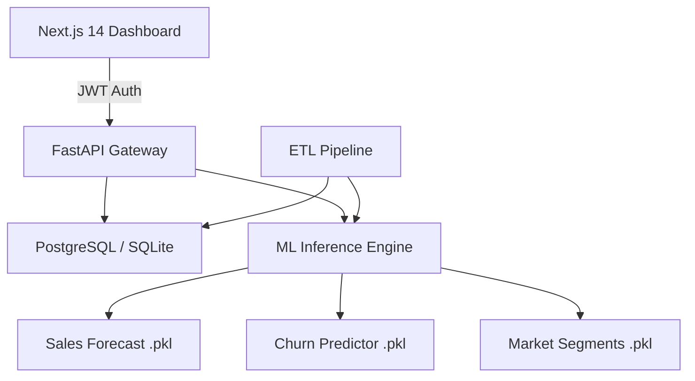

# AI Business Intelligence Platform 🚀

**Standardizing Executive Intelligence through Predictive Analytics and Secure SaaS Architecture.**

[](https://fastapi.tiangolo.com/)
[](https://nextjs.org/)
[](https://www.postgresql.org/)
[](https://scikit-learn.org/)

---

## 📖 Overview

The **AI Business Intelligence Platform** is a full-stack, production-ready SaaS ecosystem designed to transform raw transactional data into actionable strategic insights. By combining high-performance API architecture with multi-model Machine Learning persistence, the platform enables real-time sales forecasting, churn mitigation, and automated market segmentation.

### 🌟 Key Value Propositions
- **Predictive Sales Engine**: Anticipate market trends with regression-based revenue forecasting.
- **Retention Guard**: Proactively identify employee/customer churn risks using probabilistic classification.
- **Market Slicer**: Automated K-Means clustering for instant VIP and high-potential segment discovery.
- **Enterprise Security**: Industry-standard JWT-based authentication for secure data perimeter.

---

## 🏗️ Technical Architecture



### Stack Components
- **Frontend**: Next.js 14 (App Router), Tailwind CSS, Recharts, Lucide Icons.
- **Backend**: FastAPI, SQLAlchemy, Pydantic, python-jose (JWT).
- **ML Engine**: Scikit-Learn (LinearRegression, LogisticRegression, KMeans), Joblib.
- **Deployment**: Vercel (Frontend), Render (Backend/DB).

---

## 🚀 Quick Start

### 1. Backend & ML Setup
```bash
# Clone and enter directory
cd ai-bi-platform/backend

# Create environment
python -m venv venv
source venv/bin/activate # or venv\Scripts\activate

# Install dependencies
pip install fastapi uvicorn sqlalchemy scikit-learn joblib passlib[bcrypt] python-jose[cryptography] pandas

# Seed data and Train Models
python scripts/seed_data.py
python ml/trainer.py

# Launch API
uvicorn main:app --reload
```

### 2. Frontend Setup
```bash
cd ai-bi-platform/frontend
pnpm install
pnpm dev
```

---

## 📈 Impact & Business Decision Support

This platform solves critical business challenges:
1.  **Resource Allocation**: Predicts where and when revenue will grow, allowing for data-driven hiring and marketing spend.
2.  **Risk Management**: Early warning system for workforce churn, reducing replacement costs.
3.  **Customer Lifetime Value (LTV)**: Segments users automatically to tailor high-impact loyalty programs.

---

## 🌐 Deployment Instructions

### A. Backend (Render / Railway)
1.  Push the `/backend` and `/ml` folders to a new GitHub repository.
2.  Connect to Render as a **Web Service**.
3.  Build Command: `pip install -r requirements.txt && python scripts/seed_data.py && python ml/trainer.py`
4.  Start Command: `uvicorn main:app --host 0.0.0.0 --port $PORT`

### B. Frontend (Vercel)
1.  Push the `/frontend` folder to GitHub.
2.  Import project to Vercel.
3.  Set Environment Variable: `NEXT_PUBLIC_API_URL` → (Your Render API URL).

---

**Engineered with ❤️ by [Your Name]**  
*Senior Full Stack & AI Solutions Architect*
